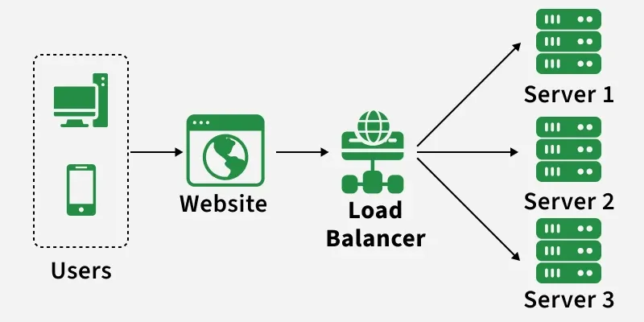
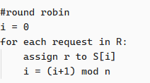

## Try it out

Start the two mock servers and the load balancer in separate terminals:

```bash
python mock_server_1.py
python mock_server_2.py
python main.py
```

Then send a few requests to the load balancer:

```bash
curl http://localhost:8000/hello
curl http://localhost:8000/hello
curl http://localhost:8000/hello
```

Requests are distributed using round robin(see personal notes below). Each request goes to the next server in sequence. Each response will show which server handled it and a running count of requests per server:

```json
{
  "status_code": 200,
  "body": {"server": "localhost:8001", "path": "/hello", "method": "GET"},
  "server_stats": {
    "http://localhost:8001": 2,
    "http://localhost:8002": 1
  }
}
```

---

### Personal notes
A load balancer is a reverse proxy that forwards the request to a server based on a traffic distribution algorithm (how and when the traffic is distributed). One of the algorithms is **round robin**, which basically assigns the requests sequentially to the servers (request 1 go to server 1, r2 to s2, r3 to s1 and so on (if 2 servers)). Another one is the **smart LB** where the LB constantly talks with the server to get some metrics. The metrics can be number of requests, system metrics, etc. 
The **goal** of a load balancer is to not overload the server. It solves the **single point of failure problem**. Achieves higher **reliability**, **performance**, **availability** and **scalability**(hard to scale without a load balancer). It's whole purpose is to **distribute traffic.** 

* How it's working: 
	* **Receiving requests:**
		* Client knows ONLY about the load balancer, i.e., a request is always made to the load balancer first. The load balancer is the single public component from the client's view. The servers are only public to the LB. This also means that the response goes through the LB. If the response is big, **Direct Server Return(DSR)** can be used where is it the server that sends the response back to the client, with the source IP address being the Load Balancer's, so the client doesn't know about the server. 
	* **Traffic distributions algorithm**:
		* Round robin
			* Let $S=[s_1, s_2, s_3, ...s_n]$ be a list of servers and $R=[r_1, r_2, r_3, ...r_m]$ a list of requests.
			* **Pros:** simple, easy to implement, no two consecutive requests are sent to the same server. **Cons**: No information about the servers. They could be of different sizes. The small size servers will die first and then the big one. Single point of failure, LB becomes pointless. 
			
		* Algo2
	* **Health checks:**
		* Algorithm chooses server(s). Check `/health` of that server by querying it or check it from a health app or something
	* **Handling Server failures**
		* Send the request to another healthy server ez pz
	* **Characteristics of Load balancers:**
		* Should handle all traffic, be secure. If it goes down, app cannot be reached => useless. That's where multiple load balancers come into game.